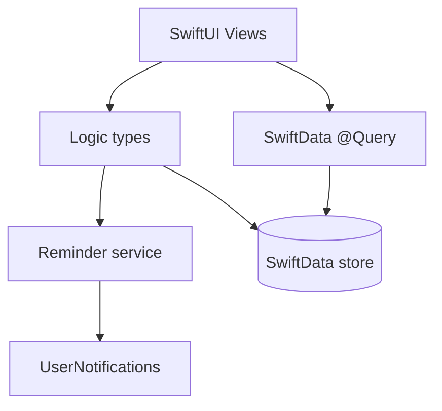

# ADR-001: App Architecture

*The app uses native SwiftUI with `@Observable` and SwiftData, with business rules kept outside the views.*

## Table of Contents

- [Status](#status)
- [Context](#context)
- [Decision](#decision)
- [Consequences](#consequences)
  - [Positive](#positive)
  - [Negative](#negative)
  - [Risks](#risks)
- [Alternatives Considered](#alternatives-considered)
- [Related Documents](#related-documents)

## Status

Proposed

## Context

The app is a local-only to-do list for iPhone and iPad. The goals are learning and portfolio quality, so clarity and modern practices matter more than layering. The MVP has one entity (`TodoItem`), a single task view, and local reminders.

## Decision

Use **native SwiftUI with `@Observable` and SwiftData** (Option A of the architecture review).

*Views read data with `@Query` and delegate rules to small logic types.*

Rules:

- Views read data with `@Query` and stay free of business rules.
- Business rules (sectioning, sorting, completion) live in small, testable types.
- Reminder scheduling lives in a dedicated service (see ADR-004).
- Folders are organized by feature: `Tasks/`, `Reminders/`, `Shared/`.
- One type per Swift file.

## Consequences

### Positive

- Fewer layers and less code than MVVM with repositories.
- Matches Apple's current recommended approach for SwiftData.
- Widgets and iCloud can be added later with little change.

### Negative

- Less practice with formal patterns such as repositories.
- Persistence is coupled to SwiftData.

### Risks

- Logic leaks into views: keep rules in logic types and review with the `swiftui-pro` skill.

## Alternatives Considered

### Option B: MVVM with a repository layer

Discarded because it adds files and boilerplate that a local MVP does not need, and it works against `@Query`.

### Option C: Hexagonal architecture with Swift packages

Discarded because the setup cost is too high for the size of the app.

## Related Documents

- [ADR-002: Local Persistence with SwiftData](ADR_002_LOCAL_PERSISTENCE_SWIFTDATA.md)
- [ADR-003: Single Task View](ADR_003_SINGLE_TASK_VIEW.md)
