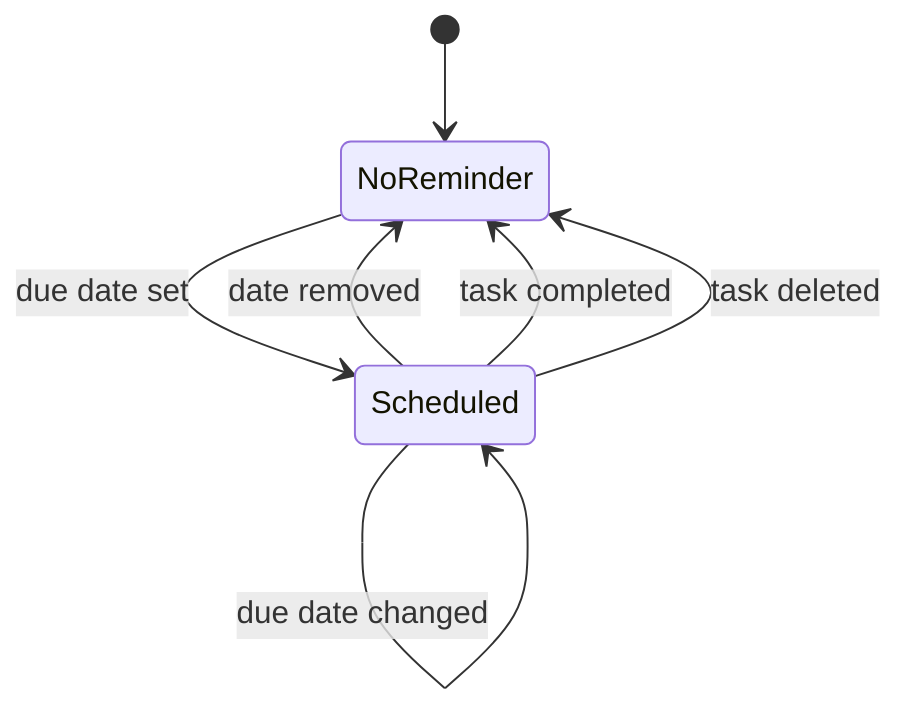

# ADR-004: Local Reminders

*Each task with a due date gets one local notification, managed by a dedicated reminder service.*

## Table of Contents

- [Status](#status)
- [Context](#context)
- [Decision](#decision)
- [Consequences](#consequences)
  - [Positive](#positive)
  - [Negative](#negative)
  - [Risks](#risks)
- [Alternatives Considered](#alternatives-considered)
- [Related Documents](#related-documents)

## Status

Accepted (2026-09-20). Implemented in feature 4 and tested in the simulator; still to be tested on a physical iPhone.

## Context

Reminders are part of the MVP. The app has no backend, so notifications must be scheduled on the device.

## Decision

Use **local notifications** through `UserNotifications`, wrapped in a reminder service.

*Reminder lifecycle for a task.*

Rules:

- One reminder per task, at the due date and time.
- No due date, no reminder.
- Completing or deleting a task cancels its notification.
- Changing the due date reschedules it.
- Reopening a completed task with a future date schedules it again.
- If notification permission is denied, the app keeps working and tells the user how to enable it.

## Consequences

### Positive

- No server and no push infrastructure.
- Works offline.

### Negative

- Only one reminder per task.
- No recurrence in the MVP.

### Risks

- Permission denied: design the flow for this case from the start.
- Notification and task state drifting apart: the service is the single place that schedules and cancels.

## Alternatives Considered

### Several reminders per task

Discarded for the MVP to keep the model simple.

### Push notifications from a backend

Discarded because the app has no backend.

## Related Documents

- [ADR-001: App Architecture](ADR_001_APP_ARCHITECTURE.md)
- [ADR-003: Single Task View](ADR_003_SINGLE_TASK_VIEW.md)
