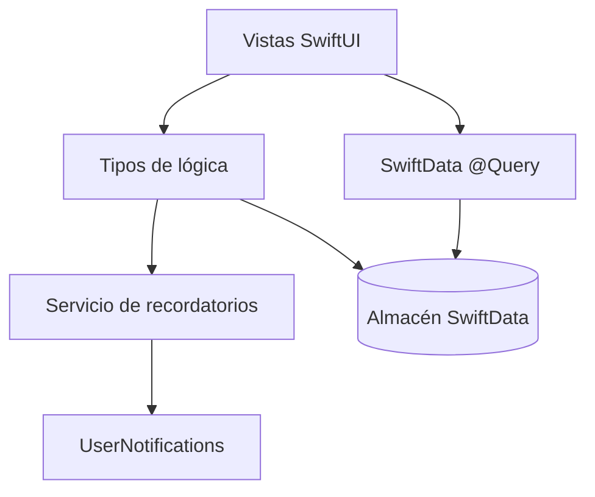

# ADR-001: Arquitectura de la app

*La app usa SwiftUI nativo con `@Observable` y SwiftData, con las reglas de negocio fuera de las vistas.*

## Tabla de contenido

- [Estado](#estado)
- [Contexto](#contexto)
- [Decisión](#decisión)
- [Consecuencias](#consecuencias)
  - [Positivas](#positivas)
  - [Negativas](#negativas)
  - [Riesgos](#riesgos)
- [Alternativas consideradas](#alternativas-consideradas)
- [Documentos relacionados](#documentos-relacionados)

## Estado

Propuesto

## Contexto

La app es una lista de tareas solo local para iPhone. Los objetivos son aprendizaje y calidad de portafolio, así que pesan más la claridad y las prácticas modernas que las capas. El MVP tiene una entidad (`TodoItem`), una vista única de tareas y recordatorios locales.

## Decisión

Usar **SwiftUI nativo con `@Observable` y SwiftData** (Opción A de la revisión de arquitectura).

*Las vistas leen datos con `@Query` y delegan las reglas a tipos de lógica pequeños.*

Reglas:

- Las vistas leen datos con `@Query` y no contienen reglas de negocio.
- Las reglas de negocio (secciones, orden, completado) viven en tipos pequeños y testeables.
- La programación de recordatorios vive en un servicio dedicado (ver ADR-004).
- Las carpetas se organizan por feature: `Tasks/`, `Reminders/`, `Shared/`.
- Un tipo por archivo Swift.

## Consecuencias

### Positivas

- Menos capas y menos código que MVVM con repositorios.
- Coincide con el enfoque que Apple recomienda hoy para SwiftData.
- Widgets e iCloud se pueden añadir después con pocos cambios.

### Negativas

- Menos práctica con patrones formales como repositorios.
- La persistencia queda acoplada a SwiftData.

### Riesgos

- Lógica que se filtra a las vistas: mantener las reglas en tipos de lógica y revisar con la skill `swiftui-pro`.

## Alternativas consideradas

### Opción B: MVVM con capa de repositorio

Descartada porque añade archivos y código repetitivo que un MVP local no necesita, y va en contra de `@Query`.

### Opción C: Arquitectura hexagonal con paquetes Swift

Descartada porque el costo de configuración es demasiado alto para el tamaño de la app.

## Documentos relacionados

- [ADR-002: Persistencia local con SwiftData](ADR_002_LOCAL_PERSISTENCE_SWIFTDATA.md)
- [ADR-003: Vista única de tareas](ADR_003_SINGLE_TASK_VIEW.md)
