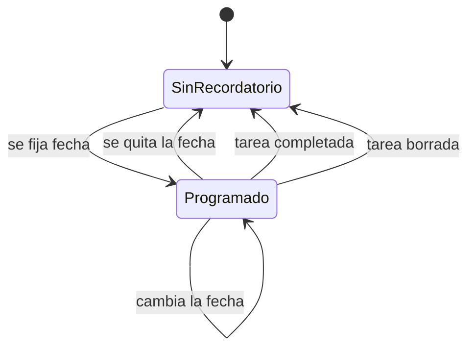

# ADR-004: Recordatorios locales

*Cada tarea con fecha de vencimiento tiene una notificación local, gestionada por un servicio de recordatorios dedicado.*

## Tabla de contenido

- [Estado](#estado)
- [Contexto](#contexto)
- [Decisión](#decisión)
- [Consecuencias](#consecuencias)
  - [Positivas](#positivas)
  - [Negativas](#negativas)
  - [Riesgos](#riesgos)
- [Alternativas consideradas](#alternativas-consideradas)
- [Documentos relacionados](#documentos-relacionados)

## Estado

Aceptado (2026-09-20). Implementado en la funcionalidad 4 y probado en el simulador y en un iPhone físico, con el teléfono bloqueado y con la app cerrada.

## Contexto

Los recordatorios forman parte del MVP. La app no tiene backend, así que las notificaciones deben programarse en el dispositivo.

## Decisión

Usar **notificaciones locales** con `UserNotifications`, encapsuladas en un servicio de recordatorios.

*Ciclo de vida del recordatorio de una tarea.*

Reglas:

- Un recordatorio por tarea, en la fecha y hora de vencimiento.
- Sin fecha de vencimiento, sin recordatorio.
- Completar o borrar una tarea cancela su notificación.
- Cambiar la fecha de vencimiento la reprograma.
- Reabrir una tarea completada con fecha futura la programa de nuevo.
- Si el permiso de notificaciones está denegado, la app sigue funcionando e indica cómo activarlo.

## Consecuencias

### Positivas

- Sin servidor ni infraestructura de push.
- Funciona sin conexión.

### Negativas

- Solo un recordatorio por tarea.
- Sin recurrencia en el MVP.

### Riesgos

- Permiso denegado: diseñar el flujo para este caso desde el inicio.
- Notificación y estado de la tarea que se desfasan: el servicio es el único lugar que programa y cancela.

## Alternativas consideradas

### Varios recordatorios por tarea

Descartada para el MVP, para mantener el modelo simple.

### Notificaciones push desde un backend

Descartada porque la app no tiene backend.

## Documentos relacionados

- [ADR-001: Arquitectura de la app](ADR_001_APP_ARCHITECTURE.md)
- [ADR-003: Vista única de tareas](ADR_003_SINGLE_TASK_VIEW.md)
